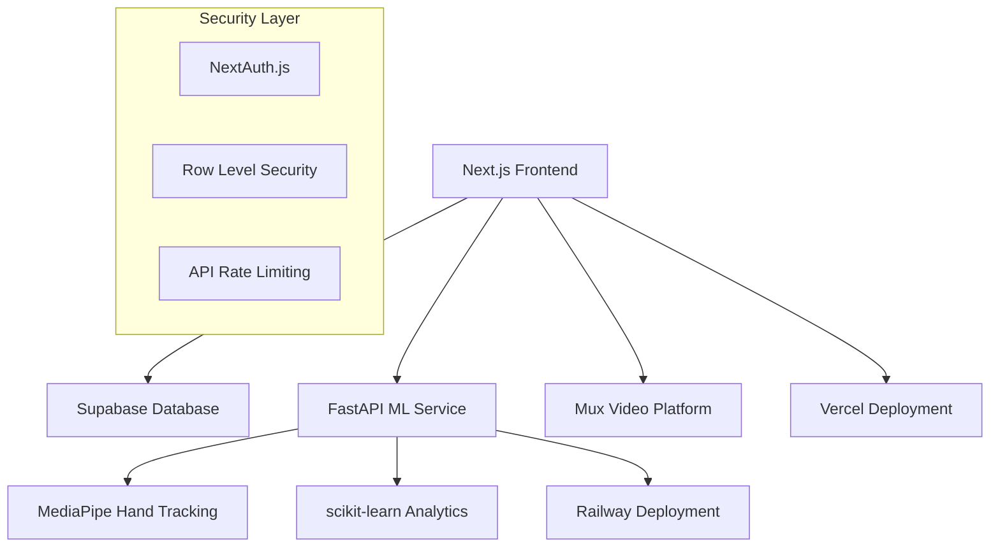

# SignLearn Pro

[](https://opensource.org/licenses/MIT)
[](https://nextjs.org/)
[](https://www.typescriptlang.org/)
[](https://fastapi.tiangolo.com/)
[](https://www.w3.org/WAI/WCAG21/quickref/)

> **Story-driven American Sign Language learning platform with AI-powered progress tracking**

SignLearn Pro combines interactive video content, machine learning-powered hand tracking, and multilingual context to create an accessible and engaging ASL educational experience for individuals and institutions.

## 🎯 **Mission Statement**

Democratize American Sign Language education through technology while respecting deaf culture and community values. Every feature is designed with accessibility-first principles and validated by the deaf/hard-of-hearing community.

## 📋 **Table of Contents**

- [Features](#-features)
- [Architecture](#-architecture)
- [Quick Start](#-quick-start)
- [Development Setup](#-development-setup)
- [API Documentation](#-api-documentation)
- [Accessibility](#-accessibility)
- [Contributing](#-contributing)
- [Deployment](#-deployment)
- [Security](#-security)
- [License](#-license)

## ✨ **Features**

### **Core Learning Platform**
- 📖 **Story-driven curriculum** - Learn ASL through engaging narratives about Curb Appeall and friends
- 🎥 **Professional video content** - High-quality ASL demonstrations with closed captions
- 🌍 **Multilingual support** - Practice with English, Spanish, French, Italian, and Portuguese contexts
- 📊 **AI-powered analytics** - Track learning progress with machine learning insights
- 🤲 **Hand tracking** - Real-time feedback using MediaPipe computer vision

### **Accessibility Features**
- ♿ **WCAG 2.1 AA compliant** - Full screen reader and keyboard navigation support
- 🎨 **High contrast mode** - Optimized for low vision users
- 📱 **Mobile-first design** - Responsive across all devices and screen sizes
- 🔊 **Audio descriptions** - Complete accessibility for blind and low-vision users
- ⌨️ **Keyboard shortcuts** - Navigate without mouse/touch input

### **Premium Features**
- 🎯 **Personalized learning paths** - AI-customized curriculum based on progress
- 📈 **Advanced analytics** - Detailed progress reports and learning insights  
- 👥 **Team management** - Tools for educators and institutional users
- 🏆 **Achievement system** - Gamified learning with certificates and badges

## 🏗 **Architecture**



### **Tech Stack**

**Frontend:**
- **Next.js 14** - React framework with App Router
- **TypeScript** - Type safety and developer experience
- **Tailwind CSS** - Utility-first styling with accessibility focus
- **Framer Motion** - Smooth animations and transitions

**Backend:**
- **FastAPI** - High-performance Python API framework
- **Supabase** - PostgreSQL database with real-time features
- **NextAuth.js** - Secure authentication and session management

**ML & Video:**
- **MediaPipe** - Computer vision for hand tracking
- **scikit-learn** - Machine learning for progress analytics
- **Mux** - Professional video streaming and analytics

**Infrastructure:**
- **Vercel** - Frontend hosting and serverless functions
- **Railway** - ML service deployment and scaling
- **Sentry** - Error tracking and performance monitoring

## 🚀 **Quick Start**

### **Prerequisites**

- Node.js 18+ and npm/yarn
- Python 3.11+ and pip
- Git for version control

### **Environment Variables**

Create `.env.local` in the root directory:

```bash
# Database
NEXT_PUBLIC_SUPABASE_URL=your_supabase_url
NEXT_PUBLIC_SUPABASE_ANON_KEY=your_supabase_key
SUPABASE_SERVICE_ROLE_KEY=your_service_role_key

# Authentication
NEXTAUTH_URL=http://localhost:3000
NEXTAUTH_SECRET=your_secret_key
GOOGLE_CLIENT_ID=your_google_client_id
GOOGLE_CLIENT_SECRET=your_google_client_secret

# Video Platform
MUX_TOKEN_ID=your_mux_token_id
MUX_TOKEN_SECRET=your_mux_token_secret
NEXT_PUBLIC_MUX_ENV_KEY=your_mux_env_key

# ML Service
ML_SERVICE_URL=http://localhost:8000
ML_SERVICE_API_KEY=your_ml_api_key

# Analytics & Monitoring
SENTRY_DSN=your_sentry_dsn
NEXT_PUBLIC_GA_ID=your_google_analytics_id
```

### **Installation**

```bash
# Clone the repository
git clone https://github.com/dapperAuteur/signlearn-pro.git
cd signlearn-pro

# Install frontend dependencies
npm install

# Install ML service dependencies
cd ml-service
pip install -r requirements.txt
cd ..

# Set up database
npx supabase db reset

# Start development servers
npm run dev        # Frontend (localhost:3000)
npm run ml:dev     # ML Service (localhost:8000)
```

Visit [http://localhost:3000](http://localhost:3000) to see the application.

## 🛠 **Development Setup**

### **Project Structure**

```
signlearn-pro/
├── src/
│   ├── app/                    # Next.js App Router pages
│   ├── components/             # Reusable React components
│   │   ├── ui/                # Base UI components
│   │   ├── video/             # Video player components  
│   │   ├── learning/          # Learning-specific components
│   │   └── accessibility/     # A11y helper components
│   ├── lib/                   # Utility functions and configs
│   ├── types/                 # TypeScript type definitions
│   └── styles/                # Global styles and Tailwind config
├── ml-service/                # FastAPI ML service
│   ├── app/                   # FastAPI application
│   ├── models/                # ML models and training scripts
│   ├── routers/               # API route handlers
│   └── utils/                 # ML utility functions
├── supabase/                  # Database migrations and functions
├── public/                    # Static assets
├── docs/                      # Additional documentation
└── tests/                     # Test files (unit, integration, e2e)
```

### **Development Commands**

```bash
# Development
npm run dev          # Start Next.js dev server
npm run ml:dev       # Start FastAPI dev server
npm run db:start     # Start local Supabase instance

# Code Quality
npm run lint         # Run ESLint
npm run type-check   # Run TypeScript compiler
npm run format       # Format code with Prettier
npm run test         # Run Jest unit tests
npm run test:e2e     # Run Playwright E2E tests

# Database
npm run db:reset     # Reset local database
npm run db:push      # Push schema changes
npm run db:generate  # Generate TypeScript types

# Build & Deploy
npm run build        # Build production bundle
npm run start        # Start production server
npm run deploy       # Deploy to production
```

### **Code Style & Quality**

- **ESLint** - Enforces code style with accessibility rules
- **Prettier** - Automatic code formatting
- **Husky** - Pre-commit hooks for quality checks
- **TypeScript strict mode** - Maximum type safety
- **80%+ test coverage** - Comprehensive testing requirements

## 📚 **API Documentation**

### **Frontend API Routes**

```typescript
// Authentication
POST /api/auth/signin          // User sign in
POST /api/auth/signup          // User registration
GET  /api/auth/session         // Current session

// Learning Content
GET  /api/stories              // Available story modules
GET  /api/stories/[id]         // Specific story content
POST /api/progress             // Update learning progress
GET  /api/analytics/[userId]   // User progress analytics

// Video Management
POST /api/videos/upload        // Upload video to Mux
GET  /api/videos/[id]/playback // Get video playback URL
POST /api/videos/[id]/captions // Add closed captions
```

### **ML Service API**

```python
# Hand Tracking
POST /analyze/hands            # Analyze hand positions in video
GET  /models/accuracy          # Get current model accuracy stats

# Learning Analytics  
POST /analytics/session        # Process learning session data
GET  /analytics/insights/[id]  # Get personalized learning insights
POST /analytics/progress       # Update progress tracking models
```

**Full API documentation:** [localhost:8000/docs](http://localhost:8000/docs) (FastAPI auto-generated)

## ♿ **Accessibility**

SignLearn Pro is built with accessibility as a core requirement, not an afterthought.

### **WCAG 2.1 AA Compliance**

- **Perceivable**: High contrast colors (4.5:1 ratio), scalable text, alt text for all images
- **Operable**: Full keyboard navigation, no seizure-inducing content, sufficient time limits
- **Understandable**: Clear navigation, consistent interface, error identification
- **Robust**: Screen reader compatible, semantic HTML, progressive enhancement

### **Sign Language Specific Features**

- **Visual feedback** for all audio cues
- **Customizable playback speed** for video content
- **Sign language interpretation** of all audio content
- **Motor accessibility** - alternative inputs for hand tracking
- **Cultural sensitivity** - content reviewed by deaf community

### **Testing Accessibility**

```bash
# Automated accessibility testing
npm run a11y:test      # axe-core accessibility tests
npm run a11y:lighthouse # Lighthouse accessibility audit

# Manual testing checklist
npm run a11y:checklist  # Interactive accessibility checklist
```

## 🤝 **Contributing**

We welcome contributions from developers, ASL educators, and community members!

### **Development Process**

1. **Fork** the repository
2. **Create** a feature branch (`git checkout -b feature/amazing-feature`)
3. **Make** your changes with tests
4. **Test** accessibility and functionality
5. **Commit** with conventional commits (`git commit -m 'feat: add amazing feature'`)
6. **Push** to your branch (`git push origin feature/amazing-feature`)
7. **Open** a Pull Request

### **Contribution Guidelines**

- **Accessibility first** - All features must meet WCAG 2.1 AA standards
- **Cultural sensitivity** - ASL content reviewed by community members  
- **Type safety** - All code must pass TypeScript strict checks
- **Test coverage** - Maintain 80%+ coverage for new code
- **Performance** - No regressions in Core Web Vitals
- **Documentation** - Update relevant docs with changes

### **Community Standards**

- **Be respectful** of deaf culture and community values
- **Follow** our [Code of Conduct](CODE_OF_CONDUCT.md)
- **Ask questions** - Use discussions for clarification
- **Provide context** - Explain the "why" behind changes

## 🚢 **Deployment**

### **Production Architecture**

- **Frontend**: Vercel with Edge Runtime
- **ML Service**: Railway with auto-scaling
- **Database**: Supabase with read replicas
- **CDN**: Mux global video delivery
- **Monitoring**: Sentry + Vercel Analytics

### **Environment Setup**

```bash
# Production deployment
npm run build
npm run deploy

# Staging environment
npm run deploy:staging

# Database migrations
npm run db:deploy
```

### **Performance Targets**

- **Core Web Vitals**: LCP <2s, CLS <0.1, FID <100ms
- **Video Streaming**: <2s initial load, <500ms seeking
- **ML Inference**: <500ms response time
- **Uptime**: 99.9% availability SLA

## 🔒 **Security**

### **Security Measures**

- **Authentication**: NextAuth.js with secure session handling
- **Database**: Row Level Security (RLS) policies
- **API**: Rate limiting and input validation
- **Content**: DRM protection via Mux
- **Compliance**: COPPA compliant for users under 13

### **Security Testing**

```bash
npm run security:audit    # npm audit + Snyk vulnerability scan
npm run security:headers  # Security headers validation
npm run security:deps     # Dependency vulnerability check
```

### **Reporting Vulnerabilities**

Please report security vulnerabilities to [security@signlearn.pro](mailto:security@signlearn.pro). We take security seriously and will respond within 24 hours.

## 📊 **Analytics & Monitoring**

### **Key Metrics**

- **Learning Outcomes**: Completion rates, retention, skill progression
- **Technical Performance**: Load times, error rates, uptime
- **Business Metrics**: User acquisition, conversion, churn
- **Accessibility**: Screen reader usage, keyboard navigation patterns

### **Monitoring Stack**

- **Error Tracking**: Sentry for real-time error monitoring
- **Performance**: Vercel Analytics + Core Web Vitals
- **ML Monitoring**: MLflow for model performance tracking
- **Uptime**: Custom health checks with PagerDuty alerts

## 📈 **Roadmap**

### **Phase 1: MVP (Months 1-3)**
- ✅ Core video playback with Mux integration
- ✅ Story-based curriculum (5 initial stories)
- ✅ User authentication and progress tracking
- ✅ Mobile-responsive design
- 🔄 Beta testing with 100 users

### **Phase 2: ML Integration (Months 4-6)**
- 🔄 MediaPipe hand tracking implementation
- ⏳ Personalized learning paths with scikit-learn
- ⏳ Premium subscription model
- ⏳ Advanced progress analytics

### **Phase 3: Enterprise Scale (Months 7-9)**
- ⏳ Multi-tenant architecture for institutions
- ⏳ Admin dashboards and reporting
- ⏳ API access for third-party integrations
- ⏳ SOC 2 Type I compliance

### **Future Considerations**
- Mobile native apps (React Native)
- Additional sign languages (BSL, LSF)
- VR/AR integration for immersive learning
- Live instruction marketplace

## 📄 **License**

This project is licensed under the MIT License - see the [LICENSE](LICENSE) file for details.

## 🙏 **Acknowledgments**

- **Deaf Community** - For guidance, feedback, and cultural education
- **ASL Educators** - For pedagogical expertise and content review  
- **Mux Team** - For video platform partnership and support
- **Open Source Contributors** - For the amazing tools that make this possible

## 📞 **Contact & Support**

- **Email**: [hello@signlearn.pro](mailto:hello@signlearn.pro)
- **Issues**: [GitHub Issues](https://github.com/dapperAuteur/signlearn-pro/issues)
- **Discussions**: [GitHub Discussions](https://github.com/dapperAuteur/signlearn-pro/discussions)
- **Twitter**: [@SignLearnPro](https://twitter.com/signlearnpro)

---

**Made with ❤️ for the deaf and hard-of-hearing community**

*SignLearn Pro is committed to accessibility, cultural sensitivity, and educational excellence. Every feature is designed with our users' diverse needs in mind.*